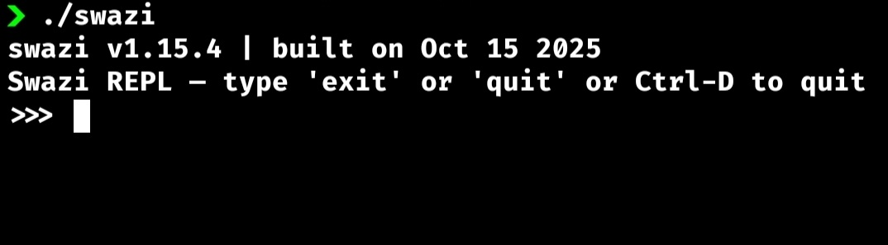

# Installation Guide

This page helps you install SwaziLang (compiler) and SwaziPen (browser IDE) so you can start coding right away.

---

## 1. Prerequisites

### SwaziLang Compiler
Right now SwaziLang do not have an official pre-built Compilers for cross-platform to just download and install, You will need to build it from source to get started. 
To build from source you need:-
- Any **C++ Compiler**: `GCC`, `Clang`, or `MSVC` (install from their official website — but if you have any don't worry)
- **CMake**: For building the project (install from their official website)
- **Python 3**: Required for `Conan` (`C/C++` dependency manager)
- **Conan**: For dependency management

### SwaziPen IDE
To also have SwaziPen IDE you need to have:-
- **Node.js**: Version 14+ recommended
- **pnpm**: Node package manager

---

## 2. Install SwaziLang

### Step A: Install Conan <span style="font-size: 10p; color: grey;"> (assuming you already have a c++ compiler, python3 pip and cmake)</span>

```bash
pip install conan
# Verify installation
conan --version
```
### Step B: Clone and Build

```bash
git clone https://github.com/godieGH/SwaziLang.git
cd SwaziLang

mkdir build && cd build # create a build dir 

conan install .. --build=missing --output-folder=. # install dependencies with conan

cmake .. && cmake --build . --parallel # the parallel flag is there to speed up the build process
# Then wait a minute or two for the build process to finish
```

### Step C: Test Installation

```bash
./swazi
```
You should see the SwaziLang REPL prompt.



There we go we got the swazi compiler right away, so we can start coding with SwaziLang

> It will be a nicer practice to add it to your system path so that it can be ran anywhere and without the `./` in ./swazi or with `.\` in .\swazi.exe(in windows)

### steps to add it in system path
* Linux and MacOs
    - To check the current system path run `echo $PATH`, this shows a list of available system paths.
    - move or copy the executable to one of the paths, and there you have the executable running anywhere
    - Or you could add a new path to the list within your ~/.bashrc or ~/.zshrc with this command
    ``` sh
    echo 'export PATH="/path/to/your/local/bin:$PATH"' >> ~/.bashrc
    # the local bin path should be the absolute path where you kept the swazi executable. for now is in the /..../SwaziLang/build/ (move/copy it if necessary to you custom local bins)
    
    # Then reload your shell configuration with
    source ~/.bashrc # for bash users
    #or 
    source ~/.zshrc # for zsh users
    
    # Verify it works by running swazi without ./
    swazi # You will see the repl
    # or with which
    which swazi # simple and clear
    ```
* For Windows
    - Using the GUI, easiest. Copy `swazi` executable to a permanent location (e.g., C:\Program Files\YourApp\ or C:\Tools\ )
    - Open System Properties:
      1) Press Win + X and select "System"
      2) Click "Advanced system settings" on the right
      3) Click "Environment Variables" button
    - Edit the PATH variable:
      1) Under "User variables" (for current user) or "System variables" (for all users), find and select "Path"
      2) Click "Edit"
     - Add your directory:
      1) Click "New"
      2) Enter the full path to the directory containing your executable (e.g., C:\Tools\)
      3) Click "OK" on all dialogs
    - Restart your terminal or Command Prompt
    - Verify it works:
      1) use `where swazi` command on your command prompt
      2) or with `swazi` to open the repl

> Note: You can just google or search for how to add an executable in System path as per device to understand more
 
## 3. Install SwaziPen {#install-swazi}

### Step A: Clone SwaziPen

```bash
git clone https://github.com/godieGH/SwaziPen.git
cd SwaziPen

# You can also use npm, ban or yarn (but recommended pnpm)
pnpm install # install dependencies
pnpm link # link it global to use it anywhere
```

### Step B: Build the Client
This right is the process of building the client (The Editor UI)
```bash
cd client
pnpm install # install client dependencies
pnpm build # build the client
```
This generates the client build in the `server/public` folder.
> The next doc-page will pass you through how to use swazipen to write SwaziLang codes

---

## 4. Troubleshooting

- **CMake not found**: [Download CMake](https://cmake.org/download/)
- **pnpm not found**: Install via `npm install -g pnpm`
- **Compiler errors**: Make sure your C++ compiler is installed and added to PATH.
- **Permission errors**: Use `sudo` if needed (Linux/macOS), or run as administrator (Windows).
---

Need help? Join the SwaziLang community or open a GitHub issue!
[issues](https://github.com/godieGH/SwaziPen/issues)